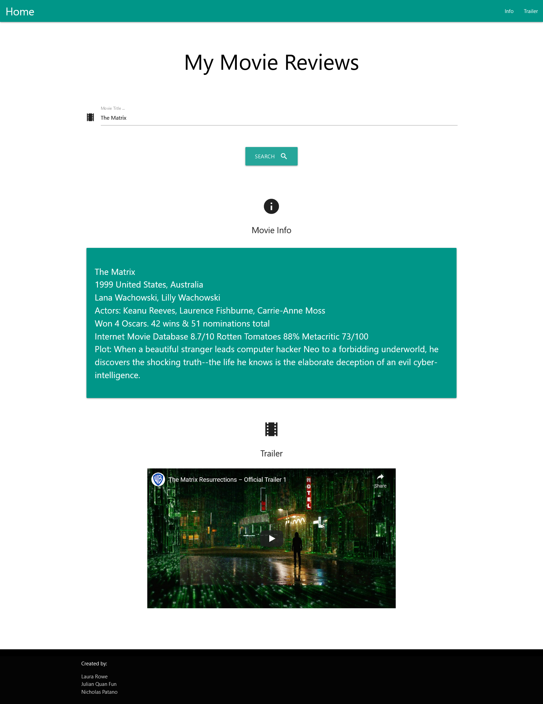

# MyMovieReviews

This site allows a user to look up a movie by title so they can view a variety of information related to it. Such as a description, information on its cast, its review scores, and its trailer. It will also remember past searches and offer to autocomplete with that data if it matches which has been typed.

[Site Link](https://lroww.github.io/MyMovieReviews-P1/)

# Technologies Used
## API's
* [OMDb](http://www.omdbapi.com/)
* [YouTube](https://www.youtube.com/yt/dev/api-resources.html)

## CSS Frameworks
* [Materialize](https://materializecss.com/)
* [Bootstrap](https://getbootstrap.com/)

# License

[MIT](https://choosealicense.com/licenses/mit/)
